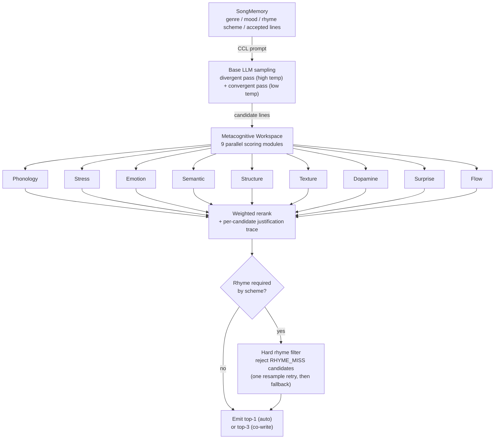
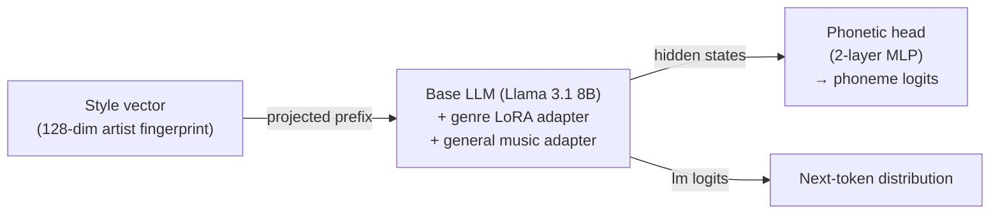

# Lyric Engine

[](https://github.com/SMXFREEZE/lyric-engine/actions/workflows/ci.yml)
[](https://www.python.org/)
[](https://pytorch.org/)
[](https://fastapi.tiangolo.com/)
[](LICENSE)

A phonetic-aware lyrics generation system built on top of large language models. Unlike generic text generators, Lyric Engine treats lyrics as *music* - with stress patterns, rhyme density, and emotional arc baked into the generation process itself.

## What makes it different

Most LLM-based lyric tools generate text and hope it rhymes. This system samples a pool of candidate lines, scores every candidate through a battery of phonetic, rhythmic, and emotional constraints, and **rejects candidates that miss a required rhyme** - if no sampled candidate rhymes, it resamples before falling back to the best available line (the miss stays visible in the generation trace).

```
Input:  genre=trap, rhyme_scheme=AABB, section=VERSE, arc=[BUILD]
Output: 8 lines where end-rhymes are phonetically verified against the
        scheme, syllable counts are scored against the target, and the
        valence trajectory matches the requested emotional arc
```

## Architecture

### Generation pipeline (implemented)



### Model (trained variant)



**Dual tokenizer** - every input is tokenized twice in parallel:
- Semantic stream: standard BPE tokens (meaning)
- Phoneme stream: CMU Pronouncing Dictionary ARPAbet tokens (sound)

**Genre LoRA adapters** - one lightweight adapter (~4M params) per genre, merged at inference with weighted blending. Blend two genres: `60% trap + 40% R&B` = interpolated adapter weights, single forward pass.

**Artist style encoder** - 128-dim vector capturing an artist's statistical fingerprint: average syllables per line, rhyme density, unique vocabulary ratio, metaphor cluster centroid (via sentence-transformers), emotional valence distribution. At inference it conditions the prompt's rhythm label (and, for the trained model variant, is injected as a prefix token into the embedding space). No verbatim lyric memorization.

**Emotional arc modeling** - songs are tagged with section-level arc tokens `[SETUP] → [BUILD] → [RELEASE] → [REFRAME] → [PEAK]`. Valence and arousal are scored per line (TextBlob / optional fine-tuned RoBERTa). The arc is enforced as a constraint during candidate scoring, not just a prompt instruction.

**Metacognitive workspace** - the reranker is organized as 9 parallel scoring modules (rhyme, stress, emotion, novelty, song structure, phonosemantic texture, hook potential, surprise, flow) whose weighted outputs select the winning line, with a human-readable justification trace per candidate and per-module reliability tracking across a session. The module names and the System 1/System 2 switching logic are **inspired by** cognitive-science frameworks (Global Workspace Theory, higher-order thought, metacognitive state vectors) as an organizing metaphor - under the hood this is an interpretable ensemble of deterministic scorers with trace logging, not a claim about consciousness.

## Project structure

```
configs/
└── genres.py               # Genre registry and style descriptions
scripts/
├── smoke_test.py           # Full pipeline test; model sections skip without torch
├── infinite_crawl.py       # Continuous Genius scraping loop
└── rewrite_train_notebook.py
notebooks/
├── train_colab.ipynb       # Training on Google Colab
├── train_kaggle.ipynb      # Training on Kaggle (T4/P100)
├── run_ai_drive.ipynb      # Inference on Google Drive checkpoint
└── run_ai_kaggle.ipynb     # Inference on Kaggle checkpoint
src/
├── data/
│   ├── scraper.py          # Genius API lyrics collection
│   ├── chart_scraper.py    # Billboard/Deezer/iTunes chart scraping
│   ├── phoneme_annotator.py # CMU dict + rule-based stress/syllable tagging
│   ├── rhyme_labeler.py    # Phoneme edit-distance rhyme scheme detection
│   ├── valence_scorer.py   # Per-line valence/arousal + arc token assignment
│   ├── style_extractor.py  # 128-dim artist style vector extraction
│   ├── style_dna.py        # Artist DNA fingerprinting
│   └── viral_analyzer.py   # Viral chart signal extraction
├── model/
│   ├── dual_tokenizer.py   # BPE + ARPAbet parallel token streams
│   ├── phonetic_head.py    # Auxiliary MLP for phoneme-aware rescoring
│   ├── lyrics_model.py     # Full model: LLM + LoRA + style projector + phonetic head
│   ├── emotional_geometry.py # 8D emotional space + trajectory engine
│   ├── phonosemantic.py    # Sound-meaning alignment (phoneme -> texture)
│   ├── dopamine_arc.py     # Tension-release curve + hook/frisson heuristics
│   ├── metacognitive_engine.py # 9-module scoring workspace + trace logging
│   └── research_scoring.py # Signals from computational musicology papers
├── generation/
│   ├── flow_dna.py         # 8 canonical flow templates (trap/melodic/etc.)
│   └── surprise_engine.py  # Predictive surprise scorer (Huron PSR model)
├── training/
│   ├── dataset.py          # Training format assembly + DataLoader
│   ├── cortical_dataset.py # Cortical Creative Loop (CCL) training format
│   ├── sft.py              # Stage 1 (general SFT) + Stage 2 (genre LoRAs)
│   └── rlhf.py             # Stage 3: reward model + PPO via TRL
├── inference/
│   └── engine.py           # Sample-then-rerank engine + CoWriteSession
├── audio/
│   ├── instrumental_generator.py # MusicGen beat generation (40+ style prompts)
│   ├── vocal_generator.py  # Bark vocal/rap generation (multi-language)
│   └── song_assembler.py   # Full song pipeline: mix, arrange, export MP3
└── api/
    └── server.py           # FastAPI: /generate, /cowrite/*, /health, /genres
tests/                      # Pure-Python pytest suite (runs without torch)
```

## What's implemented vs. planned

| Area | Status |
|---|---|
| Phoneme annotation, rhyme/stress/valence scoring | **Implemented**, unit-tested |
| 9-module metacognitive reranker + trace logging | **Implemented**, unit-tested |
| Hard rhyme filter (reject + retry + fallback) | **Implemented**, unit-tested |
| Flow DNA / surprise / dopamine heuristic scorers | **Implemented** |
| FastAPI server (/generate, /cowrite/*) | **Implemented**, schema-tested |
| Sample-then-rerank engine on any HF causal LM | **Implemented** (GPT-2 works out of the box) |
| LyricsModel (LoRA + style projector + phonetic head) | **Implemented**; training runs so far are notebook-scale (Colab/Kaggle), not the full production recipe |
| Phonetic-head constrained beam rescoring | **Component exists** (`PhoneticConstraintScorer`), not wired into the default engine - it needs a trained phonetic head |
| Audio pipeline (MusicGen + Bark + assembler) | **Implemented**, requires `requirements-audio.txt` extras |
| Token-level constrained decoding | **Planned** - current enforcement is candidate-level (sample, score, reject) |
| vLLM / Modal serverless production serving | **Design only** - nothing deployed; see below |
| Fine-tuned RoBERTa valence model | **Optional hook** - TextBlob is the default scorer |

## Training pipeline (design targets)

The staged recipe below is the intended production training plan. The compute costs are **estimates, not receipts** - actual training so far has been notebook-scale on Kaggle/Colab free tiers.

| Stage | What | Estimated compute |
|---|---|---|
| 1 | General music SFT on a large annotated corpus | 4× A100, ~$800 |
| 2 | Per-genre LoRA adapters (rank 16, 1 epoch each) | 1× A100 per genre, ~$150 total |
| 3 | RLHF/PPO with human preference ratings | 1× A100, ~$200 |
| 4 | Phonetic head training (frozen base) | 1× A100, ~$50 |

Free alternative: Kaggle (30hr/week free GPU) + Google Colab.

## Installation

```bash
git clone https://github.com/SMXFREEZE/lyric-engine
cd lyric-engine

# Core: inference, scoring, API
pip install -r requirements.txt

# Optional stacks
pip install -r requirements-audio.txt   # MusicGen/Bark song rendering
pip install -r requirements-train.txt   # SFT / LoRA / RLHF training
```

System dependencies (Linux):

```bash
sudo apt-get install espeak-ng   # phonetic fallback; NOT a pip package
```

## Local development (no GPU needed)

```bash
# Pure-Python tests (run even without torch installed)
python -m pytest tests

# Full smoke test (uses GPT-2 on CPU; model sections skip cleanly
# if torch/transformers are missing or broken)
python scripts/smoke_test.py

# Start API server (dev mode with GPT-2)
python src/api/server.py
```

API runs at `http://localhost:8000`. Try it:

```bash
curl -X POST http://localhost:8000/generate \
  -H "Content-Type: application/json" \
  -d '{"genre": "trap", "section": "VERSE", "arc_token": "[BUILD]", "num_lines": 8}'
```

## Co-write mode

```bash
# Start a session
curl -X POST http://localhost:8000/cowrite/start \
  -H "Content-Type: application/json" \
  -d '{"genre": "rnb", "rhyme_scheme": "ABAB"}'
# -> {"session_id": "abc-123"}

# Get 3 suggestions for the next line
curl -X POST http://localhost:8000/cowrite/suggest \
  -H "Content-Type: application/json" \
  -d '{"session_id": "abc-123", "n": 3}'

# Accept a line (model updates context for next generation)
curl -X POST http://localhost:8000/cowrite/accept \
  -H "Content-Type: application/json" \
  -d '{"session_id": "abc-123", "line": "I been moving in silence"}'

# Get the full song so far
curl http://localhost:8000/cowrite/song/abc-123

# End the session
curl -X DELETE http://localhost:8000/cowrite/session/abc-123
```

## Production serving (planned, not built)

A serverless deployment sketch - none of this exists yet:

```
vLLM on Modal Labs serverless
├── Scale to zero when idle
├── Auto-scale replicas under load
├── 4-bit quantization (bitsandbytes NF4)
├── Speculative decoding with 1B draft model
└── Target: full verse (8 lines) < 3s on 1× A10G
```

## Environment variables

```bash
GENIUS_TOKEN=          # Genius API token for data collection
LYRICS_MODEL_PATH=gpt2 # Path to trained model (defaults to GPT-2 for dev)
VALENCE_MODEL_PATH=    # Optional: fine-tuned RoBERTa for emotion scoring
BEAM_SIZE=8            # Candidate pool width
CORS_ORIGINS=          # Extra allowed origins (comma-separated); localhost is always allowed
HUGGING_FACE_HUB_TOKEN= # Required to download Llama 3.1
```

## Key technical decisions

**Why not just prompt GPT-4?** Prompting can't verify phonetic constraints. You can ask a chat model to rhyme - it often doesn't, and you can't tell why. This system checks every candidate's end-phoneme against the scheme with CMU-dictionary edit distance: when a rhyme is required, non-rhyming candidates are rejected and the engine resamples; only if that also fails does it emit the best available line, with the miss recorded in the trace. That's candidate-level enforcement (sample-then-rerank), not token-level decoding - token-level constrained decoding via the phonetic head is the planned next step.

**Why LoRA per genre instead of one big model?** Storage efficiency (~32MB per adapter vs retraining 8B params), composability (blend adapters at runtime), and the ability to add new genres without touching the base model.

**Why style vectors instead of fine-tuning on artist lyrics?** Copyright. A style vector is a statistical fingerprint - it captures *how* someone writes (line length, rhyme density, vocabulary spread), not *what* they wrote. The generated output is original.

**Why the brain metaphor?** The scoring modules map cleanly onto findings from freestyle-rap neuroimaging and computational musicology, and the metaphor keeps the architecture legible: parallel specialists, a weighted vote, an audit trail. It is a naming convention for an interpretable ensemble - the system does not claim to model cognition.

## License

[MIT](LICENSE) - Copyright (c) 2026 Sami El-Figha
